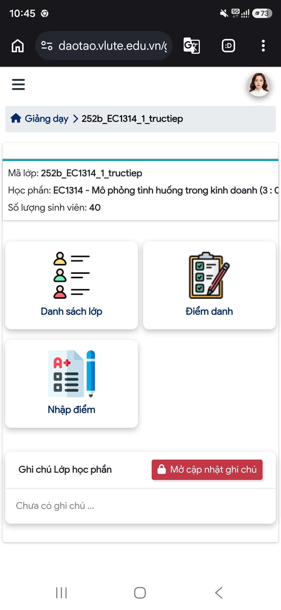
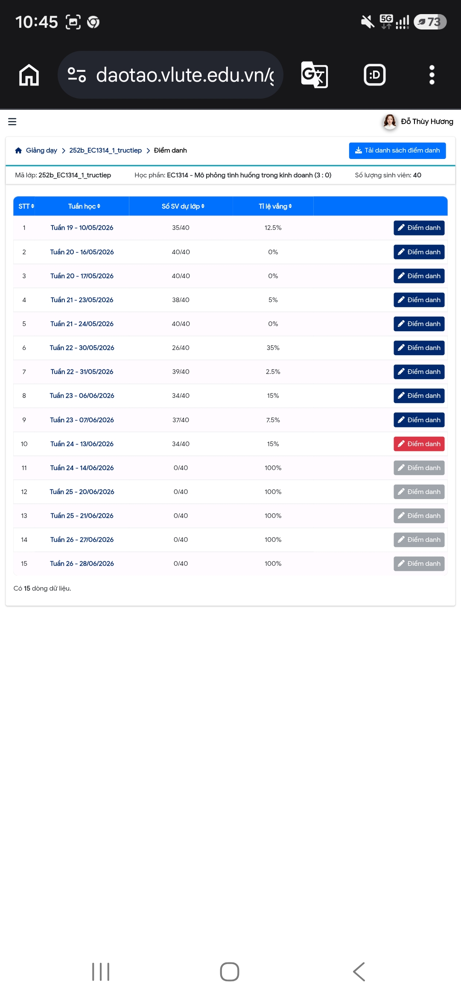

# BizArena — Business Simulation Web App

> **Course:** EC1314 — *Mô phỏng tình huống trong kinh doanh* (Business Situation Simulation) · 3 credits (3 : 0)
> **Class code:** `252b_EC1314_1_tructiep` (in-person delivery) · **Enrollment:** 40 students
> **Faculty:** FEL — Vinh Long University of Technology Education (VLUTE)
> **Instructor:** PhD Candidate **Đỗ Thúy Hương**
> **Term:** Semester 2B · Academic Year 2025–2026

**BizArena** is a classroom-based **business simulation** (serious game) used to teach
managerial decision-making. Student teams act as competing firms and, over **6 rounds**
(one round per session), make operational decisions on **price, planned quantity, and
marketing budget**. The engine computes realized **demand, revenue, cost, and profit**
through a deterministic market model, then renders a live **leaderboard** and
round-by-round analytics. It is a zero-dependency **single-page application (SPA)** that
runs entirely client-side, with **bilingual UI (VI/EN)** and state persisted to
`localStorage`.

---

## Course context

The application is deployed in an authentic instructional setting. The table below
records the institutional parameters of the host course as registered in the VLUTE
academic management system (`daotao.vlute.edu.vn`).

| Attribute | Value |
|---|---|
| Course code | EC1314 |
| Course title | *Mô phỏng tình huống trong kinh doanh* (Business Situation Simulation) |
| Credit structure | 3 credits (3 theory : 0 practice) |
| Class section | `252b_EC1314_1_tructiep` (face-to-face / in-person) |
| Enrollment | 40 students |
| Instructor of record | Đỗ Thúy Hương (PhD Candidate) |
| Faculty / unit | FEL — VLUTE |
| Term | Semester 2B, AY 2025–2026 |

### Instructional schedule

The course is delivered across 15 timetabled sessions (teaching weeks 19–26,
10 May – 28 June 2026). The six BizArena rounds are administered in sessions 5–10 of the
sequence, aligning the simulation with the cumulative learning trajectory of the term.

<p align="center">
  
  &nbsp;&nbsp;
  
</p>

<p align="center">
  <em>Figure 1.</em> Course section overview (left) and weekly attendance register (right)
  for class <code>252b_EC1314_1_tructiep</code>, as recorded in the VLUTE academic
  management system.
</p>

---

## Features

- **Setup / Configure tab** — class metadata, initial capital, time unit per round, and
  registration of **5 competing teams**.
- **Play / Instructor Console** — round timer (start / pause / reset), decision entry per
  team, **random-event** trigger, and a one-click **Finalize Round & Compute** action.
- **Leaderboard** — cumulative ranking by total profit, with revenue, cost, profit, cash,
  and average **Margin of Safety (MoS)**.
- **History / Timeline** — cumulative profit progression and per-round breakdown for all
  teams (chart-based).
- **Game Handbook** — in-app guide covering progression, workflow, and formulas.
- **Bilingual i18n** — switch between Vietnamese (VI) and English (EN) at runtime.
- **Accessibility & polish** — keyboard `:focus-visible` rings, tactile pressed states,
  balanced headline wrapping, and `prefers-reduced-motion` support.
- **Data persistence** — auto-save to `localStorage`, plus **Export / Import JSON** and
  **Reset All** for backup and migration between machines.
- **CSV export** — one-click export of the final leaderboard standings (UTF-8 BOM for
  spreadsheet compatibility) for record-keeping.
- **Instructor keyboard shortcuts** (active on the Play tab): `S` start timer · `P` pause ·
  `E` random event · `F` finalize round · `N` next round.

---

## Pedagogical design

Each round represents **one quarter of business operation**. Teams (each with a CEO, CFO,
and CMO) deliberate, then their CFO records three decisions at the instructor's desk:

1. **Price** (P)
2. **Planned Quantity** (Q_planned)
3. **Marketing Budget**

The engine derives realized demand from a downward-sloping **demand function** modulated
by a marketing-response factor and an event multiplier, then computes the financial
outcome.

### 6-Round progression

| Round | Session | Topic | Random event |
|:---:|:---:|---|:---:|
| 1 | Session 5 | Startup launch — initial pricing | — |
| 2 | Session 6 | Cost-structure refinement | — |
| 3 | Session 7 | Market volatility | **YES** (Tet / Pandemic / Competition) |
| 4 | Session 8 | Fixed-cost expansion — investment | — |
| 5 | Session 9 | Aggressive marketing campaign | **YES** (Opportunity / Risk) |
| 6 | Session 10 | Final showdown — championship | — |

### Round workflow (~15 minutes)

| Time | Activity |
|---|---|
| 0–2 min | Instructor opens the app, starts the round, projects it on screen |
| 2–7 min | Teams deliberate — CEO + CFO + CMO decide P, Q, Marketing |
| 7–9 min | Each CFO reports to the instructor desk; instructor enters the numbers |
| 9–10 min | Instructor triggers **Random Event** (Rounds 3 and 5 only) |
| 10–12 min | Instructor clicks **Finalize Round** — engine computes results |
| 12–15 min | Scoreboard + history displayed — teams review their standing |

---

## Computation model

The market engine applies the following formulas each round:

```
Demand:   Q_actual = (3000 − 50 × P) × (1 + Marketing × 0.05) × event_multiplier
Revenue:  DT = P × min(Q_planned, Q_actual)
Cost:     TC = FC(30M) + 12,000 × Q_sold + Marketing
Profit:   LN = DT − TC
MoS:      (Q_sold − Q*) / Q_sold × 100%
```

Where:

| Symbol | Meaning |
|---|---|
| `P` | Unit price set by the team |
| `Q_planned` | Quantity the team plans to produce/sell |
| `Q_actual` | Demand realized by the market model |
| `Q_sold` | Units actually sold = `min(Q_planned, Q_actual)` |
| `Marketing` | Marketing budget for the round |
| `event_multiplier` | Demand shock from a random event (Rounds 3 & 5) |
| `FC` | Fixed cost (30M VND) |
| `DT` | Revenue (*doanh thu*) |
| `TC` | Total cost |
| `LN` | Profit (*lợi nhuận*) |
| `Q*` | Break-even quantity |
| `MoS` | Margin of Safety (%) |

> The base demand curve `Q = 3000 − 50P` is linear; the marketing term applies a +5%
> demand lift per unit of marketing spend, and random events scale demand up or down.

---

## Tech stack

- **Single-file SPA** — HTML + CSS + vanilla JavaScript, **no build step, no runtime
  dependencies**.
- **State management** — in-memory app state serialized to the browser `localStorage`.
- **i18n** — runtime translation lookup (`t(key)`), VI/EN.
- **Charts** — client-side rendering for the cumulative-profit timeline.

---

## Getting started

The app is a static page — open it directly or serve it over any static HTTP server.

```bash
# Option 1 — open directly
open index.html            # macOS
# (or just double-click index.html)

# Option 2 — local static server
python3 -m http.server 8000      # then visit http://localhost:8000
# or
npx serve .
```

### Deploy on GitHub Pages

This repository ships a CI/CD workflow (`.github/workflows/pages.yml`) that builds and
publishes the site automatically on every push to `main`.

1. Push this repository to GitHub (branch `main`).
2. **Settings → Pages → Build and deployment → Source:** select **GitHub Actions**.
3. The workflow runs on each push; once it completes, the app is live at:
   `https://thuyhuongctu-cell.github.io/bizarena-fel-vlute/`

> Alternatively, without the workflow, choose **Deploy from a branch** → Branch `main` /
> `root`. Either method serves the root `index.html` directly.

---

## Data persistence & backup

> ⚠️ **Important:** all data lives **locally** in the browser via `localStorage`.
> Closing the tab is safe, but switching computers will lose state.

Use the in-app controls at the end of every session:

- **Export JSON** — download a full state snapshot for backup.
- **Import JSON** — restore state on another machine.
- **Reset All** — wipe local state for a fresh game.

---

## Project structure

```
.
├── index.html            # Entire SPA — UI, i18n, game engine, charts
├── assets/
│   ├── lms-class-overview.jpg        # VLUTE LMS — course section overview
│   └── lms-attendance-register.jpg   # VLUTE LMS — weekly attendance register
├── .github/
│   └── workflows/
│       └── pages.yml     # CI/CD — auto-deploy to GitHub Pages on push to main
├── .claude/
│   └── skills/           # Design-taste skills (dev-time) for future UI iterations
├── .gitignore
└── README.md
```

---

## Author

**Đỗ Thúy Hương** — PhD Candidate, FEL, VLUTE
ORCID: [0000-0002-7711-2487](https://orcid.org/0000-0002-7711-2487)

© 2026 · FEL_VLUTE · HK 2B · 2025–2026 — for teaching and learning purposes.
